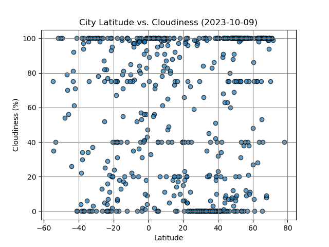

# Python API Challenge

## Overview

Welcome to the Python API Challenge repository! This project aims to explore the relationship between weather variables and latitude using Python requests, APIs, and JSON traversals. It consists of two main parts: WeatherPy and VacationPy.

### WeatherPy

In WeatherPy, over 500 cities are randomly selected, and weather data is collected using the OpenWeatherMap API. Various scatter plots are created to showcase the relationship between latitude and weather variables such as temperature, humidity, cloudiness, and wind speed. Additionally, linear regression analysis is performed to examine the correlation between latitude and each weather variable in both the Northern and Southern Hemispheres.

### VacationPy

In VacationPy, the weather data obtained from WeatherPy is used to plan future vacations. A map visualization is created to display cities with varying humidity levels. Then, cities meeting specific weather criteria (e.g., ideal temperature range, low wind speed, and no cloudiness) are identified. Finally, using the Geoapify API, nearby hotels within a certain radius of these selected cities are found and displayed on the map.

## Important Findings

### WeatherPy:

- **Temperature vs. Latitude**: Strong negative correlation observed between latitude and max temperature, indicating that temperatures tend to decrease as distance from the equator increases.

- **Humidity vs. Latitude**: Very weak to no correlation found between latitude and humidity.

- **Cloudiness vs. Latitude**: Very weak to no correlation observed between latitude and cloudiness.

- **Wind Speed vs. Latitude**: Weak correlation found between latitude and wind speed, suggesting that wind speed tends to slightly increase as distance from the equator increases.

### VacationPy:

- **Cities meeting ideal weather conditions** for vacation planning were identified based on temperature, wind speed, and cloudiness criteria.
- **Nearby hotels** within a specified radius of these cities were found using the Geoapify API and displayed on the map.

## Summary

This Python API Challenge demonstrates the use of Python libraries, requests, and APIs to collect and analyze weather data. Through data visualization and analysis, insights into the relationship between weather variables and latitude were gained. Additionally, the project showcases the practical application of weather data for vacation planning purposes.

For detailed implementation and code, please refer to the `WeatherPy.ipynb` and `VacationPy.ipynb` Jupyter notebooks provided in this repository.
